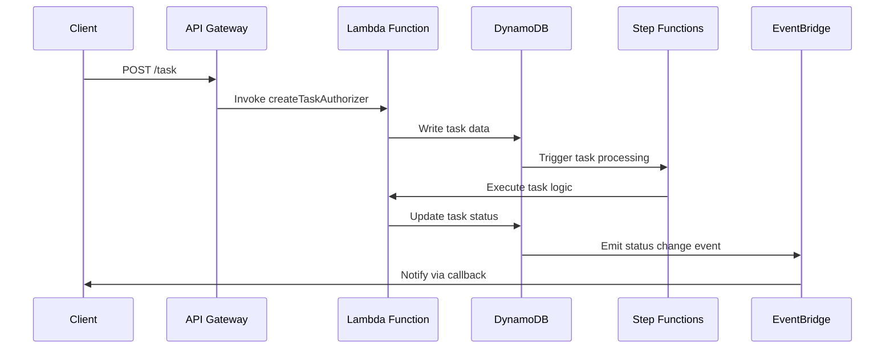

# 🏗 Architecture Documentation

## 📖 Context
* **Goal of the Repository**: This repository is designed to implement an asynchronous REST API using AWS services. The primary objective is to handle long-running tasks efficiently by leveraging AWS Step Functions, Lambda functions, and DynamoDB. This architecture provides business value by enabling scalable, reliable, and cost-effective processing of tasks that require extended execution time, without blocking client applications.
* **Used Services and Libraries**:
  - **AWS CDK**: For infrastructure as code.
  - **AWS API Gateway**: To expose RESTful endpoints.
  - **AWS Lambda**: For executing serverless functions.
  - **AWS DynamoDB**: As a NoSQL database to store task data.
  - **AWS Step Functions**: To orchestrate long-running tasks.
  - **AWS EventBridge**: For event-driven architecture.
  - **AWS IAM**: For managing access and permissions.

## 📖 Overview
* **Architecture Overview**: The architecture consists of several AWS services orchestrated to handle asynchronous task processing. Key components include:
  - **API Gateway**: Serves as the entry point for client requests, providing RESTful endpoints for task creation and status retrieval.
  - **Lambda Functions**: Execute business logic for task processing and authorization.
  - **DynamoDB**: Stores task data, including status and results.
  - **Step Functions**: Manages the workflow of long-running tasks.
  - **EventBridge**: Facilitates event-driven communication between components.
* **Component Interactions**:
  - API Gateway routes requests to Lambda functions for task creation and status checks.
  - Lambda functions interact with DynamoDB to read/write task data.
  - Step Functions orchestrate the execution of multiple Lambda functions for task processing.
  - EventBridge triggers events based on task status changes in DynamoDB.
* **Design Patterns and Architectural Decisions**:
  - **Event-Driven Architecture (EDA)**: Utilizes EventBridge for decoupled communication.
  - **Serverless Architecture**: Leverages AWS Lambda for scalable and cost-effective compute resources.
  - **Infrastructure as Code (IaC)**: Uses AWS CDK for defining and deploying infrastructure.

## 🔹 Components

| Component                  | Description                                                                                   |
|----------------------------|-----------------------------------------------------------------------------------------------|
| **API Gateway**            | Exposes RESTful endpoints for task management.                                                |
| **Lambda Functions**       | Execute task processing logic and handle authorization.                                       |
| **DynamoDB**               | Stores task data, including status and results.                                               |
| **Step Functions**         | Orchestrates the execution of long-running tasks.                                             |
| **EventBridge**            | Manages event-driven communication between components.                                        |
| **IAM Roles**              | Define permissions for accessing AWS resources.                                               |

## 🔄 Data Flow

| Step | Description                                                                                           |
|------|-------------------------------------------------------------------------------------------------------|
| 1    | Client sends a POST request to API Gateway to create a task.                                          |
| 2    | API Gateway invokes a Lambda function to authorize and process the task creation request.             |
| 3    | Lambda function writes task data to DynamoDB and triggers Step Functions for task processing.         |
| 4    | Step Functions orchestrate the execution of multiple Lambda functions to process the task.            |
| 5    | Task status updates in DynamoDB trigger events in EventBridge.                                        |
| 6    | EventBridge routes events to target services, such as notifying clients via a callback URL.           |

## 🔍 Mermaid Diagram

## 🧱 Technologies

| Technology       | Description                                      |
|------------------|--------------------------------------------------|
| **AWS CDK**      | Infrastructure as code for AWS resources.        |
| **AWS Lambda**   | Serverless compute service for executing code.   |
| **AWS DynamoDB** | NoSQL database service for storing task data.    |
| **AWS Step Functions** | Service for orchestrating workflows.       |
| **AWS API Gateway** | Service for creating RESTful APIs.            |
| **AWS EventBridge** | Event bus for event-driven architecture.      |

## 📝 **Codebase Evaluation**
* **Dependency & Coupling**: The codebase demonstrates a modular design with clear separation of concerns. Each AWS service is encapsulated within its own construct, reducing tight coupling.
* **Code Complexity**: The use of AWS CDK simplifies infrastructure management, but the complexity of the system could increase with more features. Consider breaking down large constructs into smaller, more manageable units.
* **Cloud Anti-Patterns**: 
  - **Hardcoded Secrets**: The `getKeyForClientId` function returns a hardcoded value. Consider using AWS Secrets Manager for secure key management.
  - **Error Handling**: Ensure comprehensive error handling in Lambda functions to prevent failures.
  - **Scaling**: The serverless architecture inherently supports scaling, but monitor Lambda execution times and DynamoDB throughput to optimize performance.

**Actionable Suggestions**:
- Refactor large constructs into smaller, focused modules to improve maintainability.
- Implement secure key management using AWS Secrets Manager.
- Enhance error handling in Lambda functions to ensure robust operation.