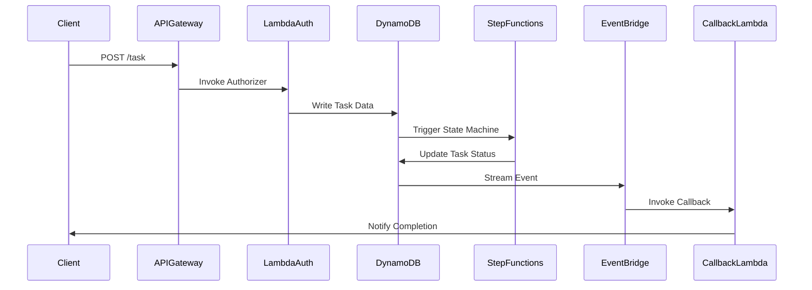

# 🏗 Architecture Documentation

## 📖 Context
* **Goal of the Repository**: This repository is designed to implement an asynchronous REST API using AWS services. The primary objective is to handle long-running tasks efficiently by leveraging AWS Step Functions, Lambda functions, and DynamoDB. This architecture provides business value by enabling scalable, reliable, and cost-effective processing of tasks that require extended execution time, without blocking client applications.
* **Used Services and Libraries**:
  - **AWS CDK**: For infrastructure as code.
  - **AWS API Gateway**: To expose RESTful endpoints.
  - **AWS Lambda**: For executing business logic and authorizers.
  - **AWS DynamoDB**: As a data store for task information.
  - **AWS Step Functions**: To orchestrate long-running tasks.
  - **AWS EventBridge**: For event-driven communication.
  - **AWS IAM**: For managing access and permissions.

## 📖 Overview
* **Architecture Overview**: The architecture consists of several AWS services orchestrated to handle asynchronous task processing. Key components include:
  - **API Gateway**: Serves as the entry point for client requests, integrating with Lambda functions for task creation and status retrieval.
  - **Lambda Functions**: Execute business logic for task processing and authorization.
  - **DynamoDB**: Stores task data, including status and results.
  - **Step Functions**: Manages the workflow of long-running tasks.
  - **EventBridge**: Facilitates event-driven communication for task completion notifications.
* **Component Interactions**:
  - API Gateway routes requests to Lambda functions, which interact with DynamoDB and Step Functions.
  - Step Functions coordinate the execution of multiple Lambda functions for task processing.
  - EventBridge triggers callbacks upon task completion.
* **Design Patterns and Decisions**:
  - **Event-Driven Architecture (EDA)**: Utilized for task completion notifications.
  - **Serverless Architecture**: Leveraging AWS Lambda and Step Functions for scalability and cost efficiency.

## 🔹 Components
| Component                  | Description                                                                                     |
|----------------------------|-------------------------------------------------------------------------------------------------|
| **API Gateway**            | Exposes RESTful endpoints for task creation and status retrieval.                               |
| **Lambda Functions**       | Execute task logic and handle authorization.                                                    |
| **DynamoDB**               | Stores task data, including status and results.                                                 |
| **Step Functions**         | Orchestrates the execution of long-running tasks.                                               |
| **EventBridge**            | Manages event-driven communication for task completion notifications.                           |
| **IAM Roles**              | Define permissions for accessing AWS resources.                                                 |

## 🔄 Data Flow
| Step | Description                                                                                     |
|------|-------------------------------------------------------------------------------------------------|
| 1    | Client sends a POST request to API Gateway to create a task.                                    |
| 2    | API Gateway invokes a Lambda function to authorize and process the request.                     |
| 3    | Lambda function writes task data to DynamoDB and triggers Step Functions.                       |
| 4    | Step Functions orchestrate the execution of multiple Lambda functions for task processing.      |
| 5    | Upon task completion, Step Functions update the task status in DynamoDB.                        |
| 6    | DynamoDB stream triggers EventBridge to notify the client via a callback URL.                   |

## 🔍 Mermaid Diagram

## 🧱 Technologies
| Technology       | Description                                      |
|------------------|--------------------------------------------------|
| **AWS CDK**      | Infrastructure as code for AWS resources.        |
| **AWS Lambda**   | Serverless compute service for executing code.   |
| **AWS DynamoDB** | NoSQL database service for storing task data.    |
| **AWS Step Functions** | Service for orchestrating workflows.       |
| **AWS EventBridge** | Event bus for event-driven communication.     |
| **Node.js**      | Runtime for executing JavaScript code.           |

## 📝 **Codebase Evaluation**
* **Dependency & Coupling**: The codebase demonstrates a modular design with clear separation of concerns. Each AWS service is encapsulated within its own construct, reducing tight coupling.
* **Code Complexity**: The use of AWS CDK simplifies infrastructure management, but the complexity of the system could increase with additional features. Consider breaking down large constructs into smaller, more manageable units.
* **Cloud Anti-Patterns**: 
  - **Hardcoded Secrets**: The `getKeyForClientId` function returns a hardcoded value. Consider using AWS Secrets Manager for secure key management.
  - **Error Handling**: Ensure comprehensive error handling in Lambda functions to prevent unhandled exceptions.
  - **Scalability**: The serverless architecture inherently supports scaling, but monitor DynamoDB capacity and Lambda concurrency limits.

**Actionable Suggestions**:
- Refactor large constructs into smaller, focused modules to improve maintainability.
- Implement secure key management using AWS Secrets Manager.
- Enhance error handling in Lambda functions to improve reliability.