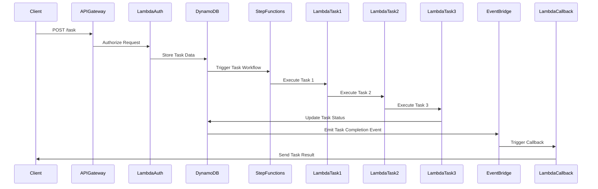

# 🏗 Architecture Documentation

## 📖 Context
* **Goal of the Repository**: This repository is designed to implement an asynchronous REST API using AWS services. The primary objective is to handle long-running tasks efficiently by leveraging AWS Step Functions, Lambda functions, and DynamoDB. This architecture provides business value by enabling scalable, reliable, and cost-effective processing of tasks that require extended execution time, without blocking client applications.
* **Used Services and Libraries**:
  - **AWS CDK**: For infrastructure as code.
  - **AWS API Gateway**: To expose RESTful endpoints.
  - **AWS Lambda**: For executing business logic in a serverless environment.
  - **AWS DynamoDB**: As a NoSQL database to store task data.
  - **AWS Step Functions**: To orchestrate long-running tasks.
  - **AWS EventBridge**: For event-driven architecture.
  - **AWS IAM**: For managing access permissions.
  - **Node.js**: As the runtime for Lambda functions.

## 📖 Overview
* **Architecture Overview**: The architecture consists of several key components:
  - **API Gateway**: Serves as the entry point for client requests, providing RESTful endpoints for task creation and status retrieval.
  - **Lambda Functions**: Handle task authorization, execution, and callback processing.
  - **DynamoDB**: Stores task data, including status and results.
  - **Step Functions**: Manages the workflow of long-running tasks, coordinating multiple Lambda functions.
  - **EventBridge**: Facilitates event-driven communication between components.
* **Component Interactions**:
  - Client requests are received by the API Gateway, which triggers Lambda functions for task processing.
  - Task data is stored in DynamoDB, and changes in task status trigger events in EventBridge.
  - Step Functions orchestrate the execution of multiple Lambda functions to complete tasks.
* **Design Patterns and Architectural Decisions**:
  - **Event-Driven Architecture (EDA)**: Utilizes EventBridge for decoupled communication.
  - **Serverless Architecture**: Leverages AWS Lambda and Step Functions for scalable and cost-effective processing.
  - **Infrastructure as Code (IaC)**: Uses AWS CDK for defining and deploying infrastructure.

## 🔹 Components
| Component                  | Description                                                                                   |
|----------------------------|-----------------------------------------------------------------------------------------------|
| **API Gateway**            | Exposes RESTful endpoints for task management.                                                |
| **Lambda Functions**       | Execute business logic for task processing and authorization.                                 |
| **DynamoDB**               | Stores task data, including status and results.                                               |
| **Step Functions**         | Orchestrates the workflow of long-running tasks.                                              |
| **EventBridge**            | Facilitates event-driven communication between components.                                    |
| **IAM Roles**              | Manage permissions for accessing AWS resources.                                               |

## 🔄 Data Flow
| Step | Description                                                                                   |
|------|-----------------------------------------------------------------------------------------------|
| 1    | Client sends a request to the API Gateway to create a task.                                   |
| 2    | API Gateway triggers a Lambda function to authorize and process the task request.             |
| 3    | Task data is stored in DynamoDB, and a Step Function is initiated to handle the task workflow.|
| 4    | Step Functions coordinate the execution of multiple Lambda functions to complete the task.    |
| 5    | Task status updates in DynamoDB trigger events in EventBridge for further processing.         |
| 6    | A callback Lambda function sends the task result back to the client via a callback URL.       |

## 🔍 Mermaid Diagram

## 🧱 Technologies
| Technology     | Description                                      |
|----------------|--------------------------------------------------|
| **AWS CDK**    | Infrastructure as Code for AWS resources.        |
| **AWS Lambda** | Serverless compute service for executing code.   |
| **AWS DynamoDB** | NoSQL database service for storing task data.  |
| **AWS Step Functions** | Service for orchestrating workflows.     |
| **AWS API Gateway** | Service for creating RESTful APIs.          |
| **AWS EventBridge** | Event bus for event-driven architecture.    |
| **Node.js**    | Runtime environment for executing JavaScript.    |

## 📝 **Codebase Evaluation**
* **Dependency & Coupling**: The codebase demonstrates a modular structure with clear separation of concerns. Each component, such as API Gateway, Lambda functions, and Step Functions, is encapsulated within its own construct, reducing tight coupling.
* **Code Complexity**: The use of AWS CDK simplifies infrastructure management, but the complexity of the system could increase with additional features. Consider breaking down large constructs into smaller, more manageable units if the codebase grows.
* **Cloud Anti-Patterns**: 
  - **Hardcoded Secrets**: The `getKeyForClientId` function returns a hardcoded value. Consider using AWS Secrets Manager or Parameter Store for secure secret management.
  - **Error Handling**: Ensure comprehensive error handling in Lambda functions to prevent failures from propagating.
  - **Scaling**: The serverless architecture inherently supports scaling, but monitor Lambda execution times and DynamoDB throughput to optimize performance.

**Actionable Suggestions**:
- Refactor large constructs into smaller, focused modules to improve maintainability.
- Implement secure secret management practices using AWS services.
- Enhance error handling in Lambda functions to improve reliability.